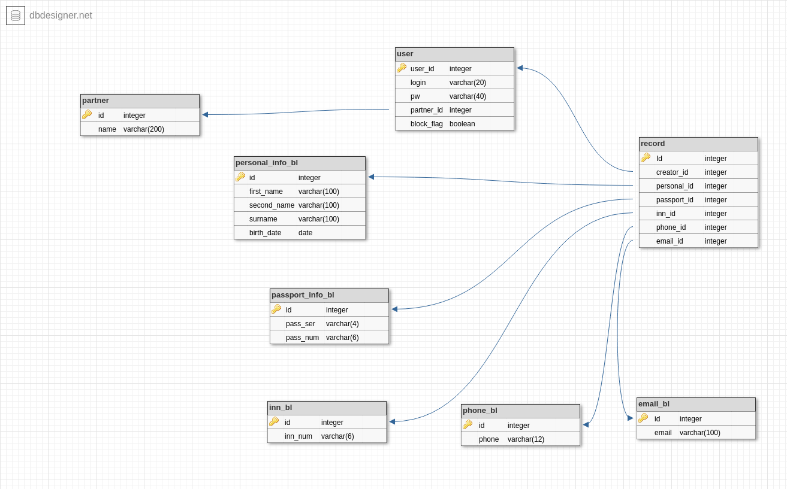

# Cервис "Черные списки"

### Документация REST API

Документация, сгенерированная Swagger'ом доступна по адресу `host:8080/swagger-ui.html#/`

### Структура базы данных

При запуске приложения liquibase выполняет файлы миграции и создает следующую структуру базы данных:

### Настройка окружения

Для локального запуска сервиса требуются следющие переменные окружения:

* `DB_HOST` - адрес хоста СУБД postgresql
* `DB_NAME` - имя базы данных
* `USER` - юзер базы данных с полными правами на базу `DB_NAME`
* `PW` - пароль юзера

Также требуется наличие на хосте openjdk-8-jdk и maven 3.6.0

### Старт сервиса:

1. `mvn clean install`
2. `java -jar micro689.jar`
3. Сервис доступен на 8080 порту